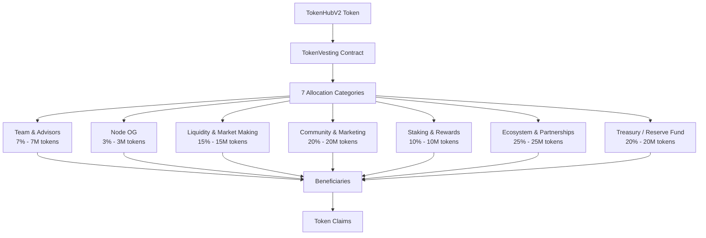
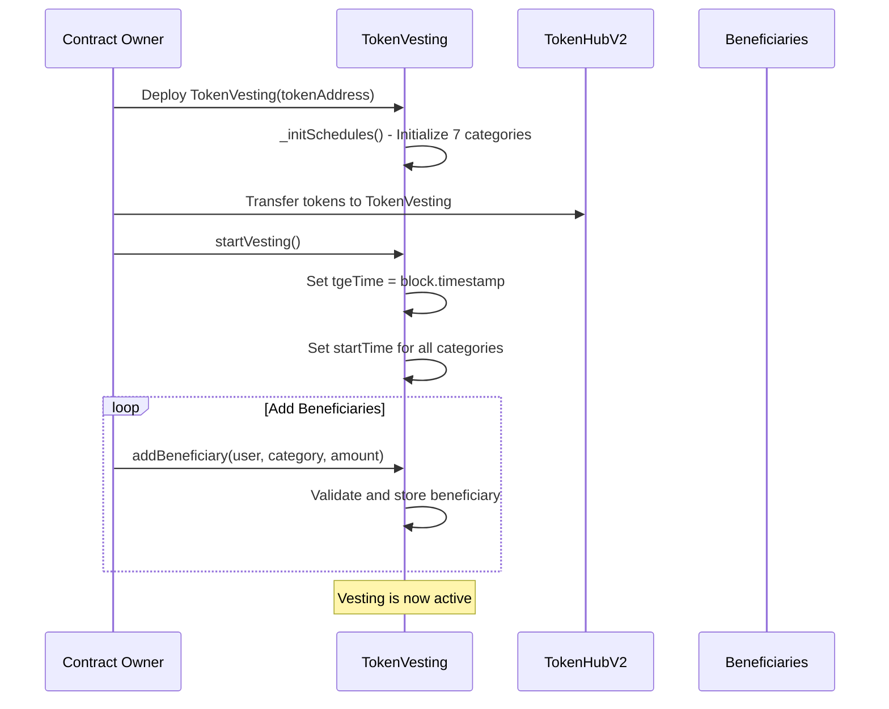
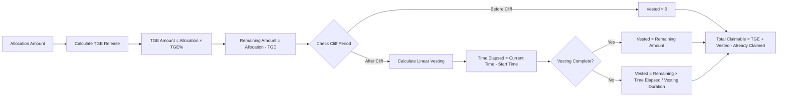
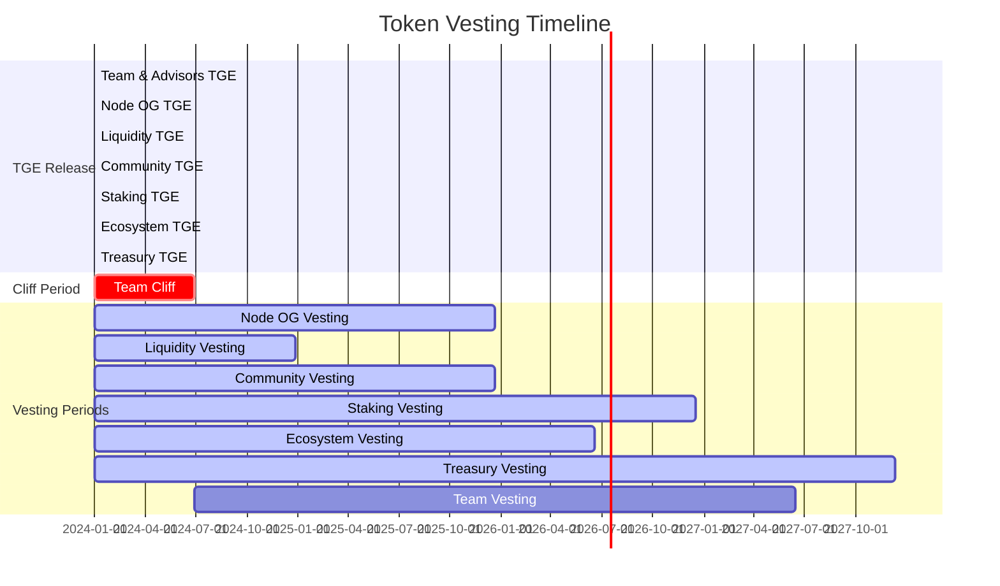

# 🔐 TokenVesting Contract - Hướng dẫn Toàn diện

## 📋 Mục lục
1. [Mục đích và Tổng quan](#mục-đích-và-tổng-quan)
2. [Kiến trúc và Sơ đồ Luồng](#kiến-trúc-và-sơ-đồ-luồng)
3. [Tính năng chính](#tính-năng-chính)
4. [Giải thích các Function](#giải-thích-các-function)
5. [Ý nghĩa các con số](#ý-nghĩa-các-con-số)
6. [Lịch trình dự kiến](#lịch-trình-dự-kiến)
7. [Bảng quy đổi](#bảng-quy-đổi)
8. [Ví dụ thực tế](#ví-dụ-thực-tế)
9. [Hướng dẫn sử dụng](#hướng-dẫn-sử-dụng)

---

## 🎯 Mục đích và Tổng quan

### Mục đích chính
TokenVesting contract được thiết kế để quản lý việc phân phối token `TokenHubV2` theo lịch trình vesting đã định sẵn với các mục tiêu:

- **Đảm bảo phân phối công bằng**: Phân phối token cho 7 hạng mục khác nhau theo tỷ lệ và lộ trình rõ ràng
- **Khuyến khích cam kết dài hạn**: Sử dụng cliff periods và vesting tuyến tính
- **Tạo sự minh bạch**: Cơ chế on-chain minh bạch cho việc mở khóa token
- **Linh hoạt quản lý**: Cho phép điều chỉnh và quản lý người thụ hưởng

### Tổng quan kỹ thuật
- **Smart Contract**: Solidity ^0.8.25
- **Dependencies**: OpenZeppelin (Ownable, ReentrancyGuard)
- **Token Standard**: ERC-20 (TokenHubV2)
- **Gas Optimization**: Sử dụng packed structs và uint96/uint32

---

## 🏗️ Kiến trúc và Sơ đồ Luồng

### Sơ đồ Kiến trúc Tổng thể



### Sơ đồ Luồng Deploy và Khởi tạo



### Sơ đồ Luồng Claim Tokens

```mermaid
flowchart TD
    A[Beneficiary calls claim()] --> B{Is beneficiary active?}
    B -->|No| C[Return: Nothing to claim]
    B -->|Yes| D{Has vesting started?}
    D -->|No| C
    D -->|Yes| E[Calculate claimable amount]
    
    E --> F{Check cliff period}
    F -->|Cliff not passed| G[Return: 0 claimable]
    F -->|Cliff passed| H[Calculate TGE amount]
    
    H --> I[Calculate linear vesting]
    I --> J[Total claimable = TGE + Vested - Claimed]
    J --> K{Is claimable > 0?}
    
    K -->|No| C
    K -->|Yes| L[Transfer tokens to beneficiary]
    L --> M[Update claimed amount]
    M --> N[Emit Claimed event]
```

### Sơ đồ Luồng Tính toán Vesting



---

## ✨ Tính năng chính

### 1. **7 Hạng mục phân bổ (Allocation Categories)**
| Category | Index | Percentage | Total Tokens | TGE Release | Cliff Period | Vesting Duration |
|----------|-------|------------|--------------|-------------|--------------|------------------|
| Team & Advisors | 0 | 7% | 7,000,000 | 0% | 180 days | 1080 days (3 years) |
| Node OG | 1 | 3% | 3,000,000 | 10% | 0 days | 720 days (2 years) |
| Liquidity & Market Making | 2 | 15% | 15,000,000 | 40% | 0 days | 360 days (1 year) |
| Community & Marketing | 3 | 20% | 20,000,000 | 20% | 0 days | 720 days (2 years) |
| Staking & Rewards | 4 | 10% | 10,000,000 | 0% | 0 days | 1080 days (3 years) |
| Ecosystem & Partnerships | 5 | 25% | 25,000,000 | 10% | 0 days | 900 days (2.5 years) |
| Treasury / Reserve Fund | 6 | 20% | 20,000,000 | 20% | 0 days | 1440 days (4 years) |

### 2. **Tính năng bảo mật**
- **Ownable**: Chỉ owner mới có thể thực hiện các thao tác quản trị
- **ReentrancyGuard**: Bảo vệ chống reentrancy attacks
- **Input Validation**: Kiểm tra đầu vào nghiêm ngặt
- **Gas Optimization**: Sử dụng packed structs để tiết kiệm gas

### 3. **Quản lý người thụ hưởng**
- Thêm từng người thụ hưởng
- Thêm hàng loạt người thụ hưởng
- Kích hoạt/hủy kích hoạt người thụ hưởng
- Theo dõi số liệu phân bổ theo danh mục

---

## 🔧 Giải thích các Function

### **Constructor**
```solidity
constructor(address _token)
```
- **Mục đích**: Khởi tạo contract với địa chỉ token
- **Tham số**: `_token` - địa chỉ của TokenHubV2 contract
- **Chức năng**: Gọi `_initSchedules()` để thiết lập 7 danh mục vesting

### **startVesting()**
```solidity
function startVesting() external onlyOwner
```
- **Mục đích**: Bắt đầu quá trình vesting
- **Chức năng**: 
  - Thiết lập `tgeTime` = thời gian hiện tại
  - Thiết lập `startTime` cho tất cả 7 danh mục
- **Lưu ý**: Chỉ có thể gọi một lần

### **addBeneficiary()**
```solidity
function addBeneficiary(address user, Category cat, uint256 amount) external onlyOwner
```
- **Mục đích**: Thêm một người thụ hưởng vào danh mục cụ thể
- **Tham số**:
  - `user`: Địa chỉ người thụ hưởng
  - `cat`: Danh mục phân bổ (0-6)
  - `amount`: Số lượng token được phân bổ
- **Validation**: Kiểm tra địa chỉ hợp lệ, số lượng > 0, không trùng lặp

### **batchAdd()**
```solidity
function batchAdd(address[] calldata users, Category cat, uint256[] calldata amounts) external onlyOwner
```
- **Mục đích**: Thêm nhiều người thụ hưởng cùng lúc
- **Tham số**:
  - `users`: Mảng địa chỉ người thụ hưởng
  - `cat`: Danh mục phân bổ
  - `amounts`: Mảng số lượng token tương ứng
- **Lưu ý**: Độ dài 2 mảng phải bằng nhau

### **claimable()**
```solidity
function claimable(address user) public view returns (uint256)
```
- **Mục đích**: Tính toán số token có thể claim
- **Logic**:
  1. Kiểm tra người thụ hưởng có active và vesting đã bắt đầu
  2. Kiểm tra cliff period
  3. Tính TGE amount
  4. Tính linear vesting amount
  5. Trả về tổng claimable - đã claim

### **claim()**
```solidity
function claim() external nonReentrant
```
- **Mục đích**: Claim token đã vest
- **Chức năng**:
  1. Tính toán số token claimable
  2. Transfer token cho người thụ hưởng
  3. Cập nhật số token đã claim
  4. Emit event Claimed

### **deactivate()**
```solidity
function deactivate(address user) external onlyOwner
```
- **Mục đích**: Hủy kích hoạt người thụ hưởng
- **Chức năng**: Đặt `active = false` cho người thụ hưởng

### **getCategoryInfo()**
```solidity
function getCategoryInfo(Category cat) external view returns (uint256 total, uint256 used, uint256 available)
```
- **Mục đích**: Lấy thông tin thống kê danh mục
- **Trả về**:
  - `total`: Tổng token trong danh mục
  - `used`: Token đã được phân bổ
  - `available`: Token còn lại có thể phân bổ

---

## 🔢 Ý nghĩa các con số

### **Basis Points (BP)**
- **Giá trị**: 10,000
- **Ý nghĩa**: 1 BP = 0.01%, 10,000 BP = 100%
- **Sử dụng**: Tính toán TGE release percentage

### **Time Constants**
- **DAY**: 1 days = 86,400 seconds
- **Cliff Days**: Số ngày chờ trước khi bắt đầu vesting
- **Vesting Days**: Tổng số ngày vesting (tính từ sau cliff)

### **Token Amounts**
- **Total Supply**: 100,000,000 tokens (100M)
- **Allocation**: Phân bổ theo tỷ lệ phần trăm
- **TGE Release**: Phần trăm token được mở khóa ngay tại TGE

### **Struct Packing**
- **uint96**: Cho allocation và claimed (đủ cho 79 tỷ token)
- **uint32**: Cho tgePercent, cliffDays, vestingDays, startTime
- **bool**: Cho active status
- **Category**: Enum 0-6 cho 7 danh mục

---

## 📅 Lịch trình dự kiến

### **Timeline Tổng thể**

| Phase | Thời gian | Mô tả |
|-------|-----------|-------|
| **TGE (Token Generation Event)** | Day 0 | Phát hành token, bắt đầu vesting |
| **Cliff Period** | Day 0-180 | Chỉ Team & Advisors có cliff 180 ngày |
| **Linear Vesting** | Day 0-1440 | Vesting tuyến tính cho tất cả danh mục |
| **Full Vesting** | Day 1440+ | Tất cả token đã được mở khóa hoàn toàn |

### **Lịch trình chi tiết theo danh mục**

| Category | TGE Release | Cliff | Vesting Start | Vesting End | Total Duration |
|----------|-------------|-------|---------------|-------------|----------------|
| **Team & Advisors** | 0% | 180 days | Day 180 | Day 1260 | 3.5 years |
| **Node OG** | 10% | 0 days | Day 0 | Day 720 | 2 years |
| **Liquidity & Market Making** | 40% | 0 days | Day 0 | Day 360 | 1 year |
| **Community & Marketing** | 20% | 0 days | Day 0 | Day 720 | 2 years |
| **Staking & Rewards** | 0% | 0 days | Day 0 | Day 1080 | 3 years |
| **Ecosystem & Partnerships** | 10% | 0 days | Day 0 | Day 900 | 2.5 years |
| **Treasury / Reserve Fund** | 20% | 0 days | Day 0 | Day 1440 | 4 years |

### **Milestone Timeline**



---

## 📊 Bảng quy đổi

### **Bảng quy đổi thời gian**

| Đơn vị | Giá trị | Ví dụ |
|--------|---------|-------|
| 1 day | 86,400 seconds | 24 × 60 × 60 |
| 1 week | 604,800 seconds | 7 × 86,400 |
| 1 month | 2,592,000 seconds | 30 × 86,400 |
| 1 year | 31,536,000 seconds | 365 × 86,400 |

### **Bảng quy đổi TGE Release**

| TGE % | Basis Points | Decimal | Ví dụ (1M tokens) |
|-------|--------------|---------|-------------------|
| 0% | 0 | 0.00 | 0 tokens |
| 5% | 500 | 0.05 | 50,000 tokens |
| 10% | 1,000 | 0.10 | 100,000 tokens |
| 20% | 2,000 | 0.20 | 200,000 tokens |
| 40% | 4,000 | 0.40 | 400,000 tokens |
| 100% | 10,000 | 1.00 | 1,000,000 tokens |

### **Bảng quy đổi Token Amounts**

| Amount | Wei | Ether | Description |
|--------|-----|-------|-------------|
| 1 token | 1,000,000,000,000,000,000 | 1.0 | 1 THD token |
| 1,000 tokens | 1,000,000,000,000,000,000,000 | 1,000.0 | 1K THD |
| 1,000,000 tokens | 1,000,000,000,000,000,000,000,000 | 1,000,000.0 | 1M THD |
| 100,000,000 tokens | 100,000,000,000,000,000,000,000,000 | 100,000,000.0 | 100M THD (Total Supply) |

### **Bảng quy đổi Category Index**

| Index | Category Name | Percentage | Total Tokens |
|-------|---------------|------------|--------------|
| 0 | Team & Advisors | 7% | 7,000,000 |
| 1 | Node OG | 3% | 3,000,000 |
| 2 | Liquidity & Market Making | 15% | 15,000,000 |
| 3 | Community & Marketing | 20% | 20,000,000 |
| 4 | Staking & Rewards | 10% | 10,000,000 |
| 5 | Ecosystem & Partnerships | 25% | 25,000,000 |
| 6 | Treasury / Reserve Fund | 20% | 20,000,000 |

---

## 💡 Ví dụ thực tế

### **Ví dụ 1: Team & Advisors Vesting**

**Thông tin:**
- Beneficiary: `0x1234...5678`
- Category: Team & Advisors (0)
- Allocation: 1,000,000 tokens
- TGE Release: 0%
- Cliff: 180 days
- Vesting: 1080 days (3 years)

**Timeline:**
```
Day 0:   TGE = 0 tokens (0%)
Day 180: Cliff ends, vesting starts
Day 365: 1 year = 185 days vesting = 17.1% of remaining = 171,000 tokens
Day 730: 2 years = 550 days vesting = 50.9% of remaining = 509,000 tokens  
Day 1080: 3 years = 900 days vesting = 83.3% of remaining = 833,000 tokens
Day 1260: Full vesting = 100% = 1,000,000 tokens
```

**Code Example:**
```javascript
// Add beneficiary
await tokenVesting.addBeneficiary("0x1234...5678", 0, ethers.parseEther("1000000"));

// Check claimable after 1 year (365 days)
await time.increase(365 * 24 * 60 * 60);
const claimable = await tokenVesting.claimable("0x1234...5678");
console.log("Claimable after 1 year:", ethers.formatEther(claimable)); // ~171,000 tokens
```

### **Ví dụ 2: Node OG Vesting**

**Thông tin:**
- Beneficiary: `0xabcd...efgh`
- Category: Node OG (1)
- Allocation: 500,000 tokens
- TGE Release: 10%
- Cliff: 0 days
- Vesting: 720 days (2 years)

**Timeline:**
```
Day 0:   TGE = 50,000 tokens (10%)
Day 180: 6 months = 25% of remaining = 112,500 tokens (Total: 162,500)
Day 360: 1 year = 50% of remaining = 225,000 tokens (Total: 275,000)
Day 540: 1.5 years = 75% of remaining = 337,500 tokens (Total: 387,500)
Day 720: 2 years = 100% = 450,000 tokens (Total: 500,000)
```

**Code Example:**
```javascript
// Add beneficiary
await tokenVesting.addBeneficiary("0xabcd...efgh", 1, ethers.parseEther("500000"));

// Claim TGE immediately
const tgeClaimable = await tokenVesting.claimable("0xabcd...efgh");
console.log("TGE claimable:", ethers.formatEther(tgeClaimable)); // 50,000 tokens

await tokenVesting.connect(beneficiary).claim();
```

### **Ví dụ 3: Liquidity & Market Making**

**Thông tin:**
- Beneficiary: `0x9999...8888`
- Category: Liquidity & Market Making (2)
- Allocation: 2,000,000 tokens
- TGE Release: 40%
- Cliff: 0 days
- Vesting: 360 days (1 year)

**Timeline:**
```
Day 0:   TGE = 800,000 tokens (40%)
Day 90:  3 months = 25% of remaining = 300,000 tokens (Total: 1,100,000)
Day 180: 6 months = 50% of remaining = 600,000 tokens (Total: 1,400,000)
Day 270: 9 months = 75% of remaining = 900,000 tokens (Total: 1,700,000)
Day 360: 1 year = 100% = 1,200,000 tokens (Total: 2,000,000)
```

### **Ví dụ 4: Batch Add Beneficiaries**

```javascript
// Batch add multiple Node OG beneficiaries
const beneficiaries = [
    "0x1111...2222",
    "0x3333...4444", 
    "0x5555...6666"
];

const allocations = [
    ethers.parseEther("100000"),  // 100K tokens
    ethers.parseEther("200000"),  // 200K tokens
    ethers.parseEther("150000")   // 150K tokens
];

await tokenVesting.batchAdd(beneficiaries, 1, allocations); // Category 1 = Node OG
```

### **Ví dụ 5: Category Statistics**

```javascript
// Get category information
const categoryInfo = await tokenVesting.getCategoryInfo(1); // Node OG
console.log("Total allocation:", ethers.formatEther(categoryInfo.total));    // 3,000,000
console.log("Used allocation:", ethers.formatEther(categoryInfo.used));      // 450,000 (from batch add)
console.log("Available:", ethers.formatEther(categoryInfo.available));       // 2,550,000
```

---

## 🚀 Hướng dẫn sử dụng

### **1. Deploy Contract**

```bash
# Deploy với token address có sẵn
TOKEN_ADDRESS=0x1234... npx hardhat run scripts/deploy-vesting.js --network bscTestnet

# Hoặc deploy cả TokenHubV2 và TokenVesting
npx hardhat run scripts/deploy-vesting.js --network bscTestnet
```

### **2. Khởi tạo Vesting**

```javascript
// Start vesting (chỉ có thể gọi một lần)
await tokenVesting.startVesting();
```

### **3. Thêm Beneficiaries**

```javascript
// Thêm từng người
await tokenVesting.addBeneficiary(
    "0x1234...5678",  // beneficiary address
    0,                // category (Team & Advisors)
    ethers.parseEther("1000000")  // 1M tokens
);

// Thêm hàng loạt
const users = ["0x1111...", "0x2222...", "0x3333..."];
const amounts = [
    ethers.parseEther("100000"),
    ethers.parseEther("200000"), 
    ethers.parseEther("150000")
];
await tokenVesting.batchAdd(users, 1, amounts); // Node OG category
```

### **4. Claim Tokens**

```javascript
// Check claimable amount
const claimable = await tokenVesting.claimable("0x1234...5678");
console.log("Claimable:", ethers.formatEther(claimable));

// Claim tokens
await tokenVesting.connect(beneficiary).claim();
```

### **5. Quản lý Admin**

```javascript
// Deactivate beneficiary
await tokenVesting.deactivate("0x1234...5678");

// Get category statistics
const stats = await tokenVesting.getCategoryInfo(0);
console.log("Category stats:", stats);
```

### **6. Testing**

```bash
# Run tests
npx hardhat test test/vesting-test.js

# Run specific test
npx hardhat test test/vesting-test.js --grep "Should add beneficiary correctly"
```

### **7. Verify Contract**

```bash
# Verify on BSCScan
npx hardhat verify --network bscTestnet <CONTRACT_ADDRESS> <TOKEN_ADDRESS>
```

---

## 🔍 Troubleshooting

### **Lỗi thường gặp**

| Lỗi | Nguyên nhân | Giải pháp |
|-----|-------------|-----------|
| "Already started" | Gọi startVesting() nhiều lần | Chỉ gọi một lần duy nhất |
| "Invalid input" | Địa chỉ zero hoặc amount = 0 | Kiểm tra input parameters |
| "Already exists" | Thêm beneficiary trùng lặp | Kiểm tra beneficiary đã tồn tại |
| "Exceeds limit" | Vượt quá allocation của category | Kiểm tra tổng allocation |
| "Nothing to claim" | Không có token để claim | Kiểm tra cliff period và vesting |

### **Best Practices**

1. **Luôn kiểm tra claimable amount trước khi claim**
2. **Sử dụng batchAdd cho nhiều beneficiaries cùng category**
3. **Theo dõi category statistics để tránh vượt quá allocation**
4. **Test kỹ trên testnet trước khi deploy mainnet**
5. **Backup private keys và contract addresses**

---

## 📞 Hỗ trợ

Để được hỗ trợ về TokenVesting contract, vui lòng:

1. Kiểm tra tài liệu này trước
2. Chạy test suite để verify functionality
3. Liên hệ team development với thông tin chi tiết về lỗi

**Contract Address**: `[Sẽ được cập nhật sau khi deploy]`
**Token Address**: `[Sẽ được cập nhật sau khi deploy]`
**Network**: BSC Testnet / BSC Mainnet

---

*Tài liệu này được cập nhật lần cuối: [Ngày hiện tại]*
*Version: 1.0.0*
